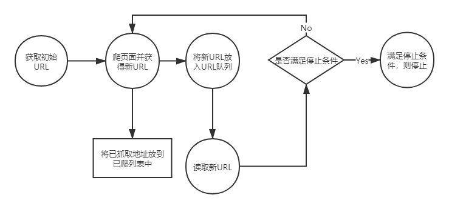

---

---

# 网络爬虫是什么

​	简单来说，网络爬虫就是自动从互联网中定向或不定向(搜索引擎)的采集信息的一种程序。

​	网络爬虫有很多种类型，常用的有通用网络爬虫、聚焦网络爬虫等。

​	网络爬虫可以做很多事情，不如通用网络爬虫可以用在搜索引擎中，聚焦爬虫可以从互联网中自动采集信息并代替我们筛选出相关的数据出来。具体来说，网络爬虫经常可以应用在以下方面：

​	1、搜索引擎

​	2、采集金融数据

​	3、采集商品数据

​	4、自动过滤广告

​	5、采集竞争对手的客户数据

​	6、采集行业相关数据，进行数据分析

​	......


# 爬虫的运行原理

​	通用聚焦网络爬虫运行原理



# [正则表达式](https://docs.python.org/zh-cn/3/library/re.html#module-contents)

### 原子

原子是正则表达式中最基本的组成单位，每个正则表达式中至少要包含一个原子。常见的原子类型有：

```python
#普通的字符串
import re
strs="demo exec"
pat="demo"
rst=re.search(pat, strs)
print(rst)
#非打印字符
# \n \t
#通用字符作为原子
"""
\w 字母、数字、下划线
\W 除字母、数字、下划线
\d 十进制数字
\D 除十进制数字
\s 空白字符
\S 除空白字符
"""
#原子表
#[element1, element2,...]
```

### 元字符

所谓的元字符，就是这种表达式中具有一些特殊含义的字符，比如重复N次前面的字符等。

```python
"""
. 除换行外任意一个字符
^ 开始位置
$ 结束位置
* 0\1\多次
？0\1次
+ 1\多次
{n} 恰好出现n次
{n,} 至少出现n次
{n,m} 至少n次，至多m次
| 模式选择符
() 模式单元
"""
```

### 模式修正符

所谓模式修正符，即可以在不改变正则表达式的情况下，通过模式修正符改变正则表达式的含义，从而实现一些匹配结果的调整功能。

```python
"""
I 匹配时忽略大小写 *
M 多行匹配 *
S 让.匹配包括换行符 *
L 本地化识别配置
U Unicode
"""
```

### 贪婪模式与兰多模式

贪婪模式的核心点就是尽肯能多的匹配，而懒惰模式的核心点就是尽可能少的匹配。

```python
string="pythonpython"
pat1="p.*y"
pat2="p.*?y" #懒惰模式，精准
rst1=re.search(pat1,string) # pythonpy
rst2=re.search(pat1,string,re.I) # py
```

### 正则表达式函数

正则表达式函数有re.match()函数、re.search()函数、全局匹配函数、re.sub()函数

```python
#1、match  从头开始匹配，返回一个结果
#2、search 返回第一个匹配的结果
#3、全局匹配函数 返回全部匹配结果
string="fasfsdafasdfasfdasfsdfsfdd"
pat="f.*?f"
rst1=re.match(pat, string) # <re.Match object; span=(0, 4), match='fasf'>
rst2=re.search(pat, string) # <re.Match object; span=(0, 4), match='fasf'>
rst3=re.compile(pat).findall(string) # <re.Match object; span=(0, 4), match='fasf'>
```

### 常见正则实例

```python
string='<a href="http://news.baidu.com" name="tj_trnews" class="mnav">新闻</a>'
pat="[a-zA-Z]+://[^\s]*[.com|.cn]" #todo 原子表中的.实际未起到作用，\.只在外面起作用，在里面未起作用
rst=re.compile(pat).findall(string)
```

简单的爬虫编写

```python
import urllib.request
url="http://www.csdn.net"
data=urllib.request.urlopen(url).read()
```

# [urllib基础](https://docs.python.org/zh-cn/3/library/urllib.request.html)

## [`urllib.parse`](https://docs.python.org/zh-cn/3/library/urllib.parse.html#module-urllib.parse) 用于解析 URL

**源代码:** [Lib/urllib/parse.py](https://github.com/python/cpython/tree/3.9/Lib/urllib/parse.py)

该模块定义了一个标准接口，用于URL字符串按组件(协议、网络位置、路径等)分解，或将组件组合回URL字符串，并将 "相对URL "转换为给定 "基础URL "的绝对URL。

## [`urllib.request`](https://docs.python.org/zh-cn/3/library/urllib.request.html#module-urllib.request) --- 用于打开 URL 的可扩展库

[`urllib.request`](https://docs.python.org/zh-cn/3/library/urllib.request.html#module-urllib.request) 模块定义了适用于在各种复杂情况下打开 URL（主要为 HTTP）的函数和类 --- 例如基本认证、摘要认证、重定向、cookies 及其它。

`urllib.request.urlopen`(*url*, *data=None*, [*timeout*, ]***, *cafile=None*, *capath=None*, *cadefault=False*, *context=None*)

打开统一资源定位地址 *url*，可以是一个字符串或一个 [`Request`](https://docs.python.org/zh-cn/3/library/urllib.request.html#urllib.request.Request) 对象。

`urllib.request.urlretrieve(url, filename=None, reporthook=None, data=None)`

Copy a network object denoted by a URL to a local file. If the URL points to a local file, the object will not be copied unless filename is supplied.

网页,文本文件等存储地址，直接下载到本地

`Request.add_header`(*key*, *val*)

`Request.add_unredirected_header`(*key*, *header*)

添加一个不会被加入重定向请求的头部。

`Request.set_proxy`(*host*, *type*)

`Request.get_header`(*header_name*, *default=None*)

`Request.header_items`()

Return a list of tuples (header_name, header_value) of the Request headers.

## [`urllib.response`](https://docs.python.org/zh-cn/3/library/urllib.request.html#module-urllib.response) --- urllib 使用的 Response 类

The [`urllib.response`](https://docs.python.org/zh-cn/3/library/urllib.request.html#module-urllib.response) module defines functions and classes which define a minimal file-like interface, including `read()` and `readline()`. Functions defined by this module are used internally by the [`urllib.request`](https://docs.python.org/zh-cn/3/library/urllib.request.html#module-urllib.request) module. The typical response object is a [`urllib.response.addinfourl`](https://docs.python.org/zh-cn/3/library/urllib.request.html#urllib.response.addinfourl) instance:

## [`urllib.error`](https://docs.python.org/zh-cn/3/library/urllib.error.html#module-urllib.error) --- urllib.request 引发的异常类

[`urllib.error`](https://docs.python.org/zh-cn/3/library/urllib.error.html#module-urllib.error) 模块为 [`urllib.request`](https://docs.python.org/zh-cn/3/library/urllib.request.html#module-urllib.request) 所引发的异常定义了异常类。 基础异常类是 [`URLError`](https://docs.python.org/zh-cn/3/library/urllib.error.html#urllib.error.URLError)。

## [`urllib.robotparser`](https://docs.python.org/zh-cn/3/library/urllib.robotparser.html#module-urllib.robotparser) --- robots.txt 语法分析程序

此模块提供了一个单独的类 [`RobotFileParser`](https://docs.python.org/zh-cn/3/library/urllib.robotparser.html#urllib.robotparser.RobotFileParser)，它可以回答关于某个特定用户代理是否能在 Web 站点获取发布 `robots.txt` 文件的 URL 的问题。 有关 `robots.txt` 文件结构的更多细节请参阅 http://www.robotstxt.org/orig.html。

# 超时设置

`urllib.request.urlopen`(*url*, *data=None*, [*timeout*, ]***, *cafile=None*, *capath=None*, *cadefault=False*, *context=None*)

# 自动模拟http

```python
#get请求--实现自动百度信息搜索
import urllib.request,re
keywd="demo"
keywd=urllib.request.quote(keywd) #URL转码
for i in range(10):
    url="http://www.baidu.com/s?wd="+keywd+"&pn="+str((i-1)*10)
    data=urllib.request.urlopen(url).read().decode("utf-8")
    pat1="title:'(.*?),'"
    pat2='"title":""(.*?),"'
    rst1=re.compile(pat1).findall(data)
    rst2=re.compile(pat2).findall(data)
    for j in range(0,len(rst1)):
        print(rst1[j])
    for k in range(0,len(rst2)):
        print(rst1[k])
```


```python
import urllib.request
import urllib.parse
posturl="http://www.iqianyue.com/mypost/"
postdata=urllib.parse.urlencode({
"name":"demo@demo.com",
"pass":"passwd"
})
#进行post，使用urllib.request下面的 Request封装(真实地址，post数据)
req=urllib.request.Request(posturl, postdata)
rst=urllib.request.urlopen(req).read().decode("utf-8")
```


